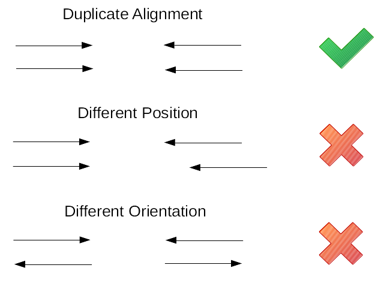

# Assembly of mitochondrial genomes

We are going to see two different ways of assembling mitochondrial genomes:
+ reference-based: using [bwa](https://github.com/lh3/bwa).
+ seed and extension, using [NOVOplasty](https://github.com/ndierckx/NOVOPlasty).

## mapping with **bwa**

Quality-trimmed paired-end Illumina sequencing reads from *Rattus tiomanicus* USNM590332 will be mapped to the curated mitogenome [NC_029888](https://www.ncbi.nlm.nih.gov/nucleotide/NC_029888.1) available in Genbank.

1. download NC_029888 in fasta and gb format from Genbank. The can also be found in the [references](references) folder.
2. index the reference using bwa. It allows more efficient search of the genome during sequence alignment. Check the new files created in `references`.

```
bwa index references/NC_029888.fasta
```
3. map the sequencing reads from USNM590332 to the reference using the mem algorithm using the default parameters.

```
bwa mem references/NC_029888.fasta \
 intermediate/USNM590332_trimmed_1.fastq \
 intermediate/USNM590332_trimmed_2.fastq > intermediate/USNM590332.sam
```
Check the Sequence Alignment Map (SAM) [format](https://samtools.github.io/hts-specs/SAMv1.pdf). Run `head intermediate/USNM590332.sam`.
.

4. Filter BAM, sort and remove duplicates

**samtools** provide a set of tools to work with SAM files, or their binary format (BAM).
We will filter low-quality mapping reads, remove unmapped reads, sort the sequences and remove the PCR duplicates.

Using `samtools view ` we can create a binary file (BAM) `-b` and remove the unmapped reads `-F4`. The output needs to be sorted, that means sorting the mapped reads according to their coordinates in the reference: `samtools sort -o `. The resulting file will be ready for duplicate removal. This step is necessary as during the preparation of libraries for Illumina there can be PCR steps in which PCR errors can be introduced in the sequences. By chance those errors can become in high frequencies. So, if they are not removed they can be mistaken with real variation. The strategy followed by samtools to remove PCR duplicates is to eliminate those reads with exact same mapping coordinates: `samtoos rmdup -s `.

.

These steps can be piped, but below are shown independently:
```
samtools view -Shu -F4 intermediate/USNM590332.sam > intermediate/USNM590332.bam
samtools sort -o intermediate/USNM590332_sorted.bam intermediate/USNM590332.bam
samtools rmdup intermediate/USNM590332_sorted.bam intermediate/USNM590332_rmdup.bam
```

4. Visualize mapping file and get consensus sequences.

There are many softwares to visualize BAM/SAM files. We can use Geneious (visualizing is free), [UGENE](http://ugene.net/), [IGV](https://software.broadinstitute.org/software/igv/download), [Tablet](https://ics.hutton.ac.uk/tablet/download-tablet/).

*Compare to the non-filtered SAM*

From the alignment file we need to extract the information for downstream analysis.
+ call variants: we are not going over it. But if you are interested check [GATK](https://gatk.broadinstitute.org/hc/en-us/categories/360002302312).
+ get consensus sequences. This can be done very straightforward and freely in Geneious. Other more complex options are `samtools mpileup`, [vcf-consensus](http://vcftools.sourceforge.net/perl_module.html#vcf-consensus), and [GATK](https://gatk.broadinstitute.org/hc/en-us/articles/360037594571-FastaAlternateReferenceMaker).
